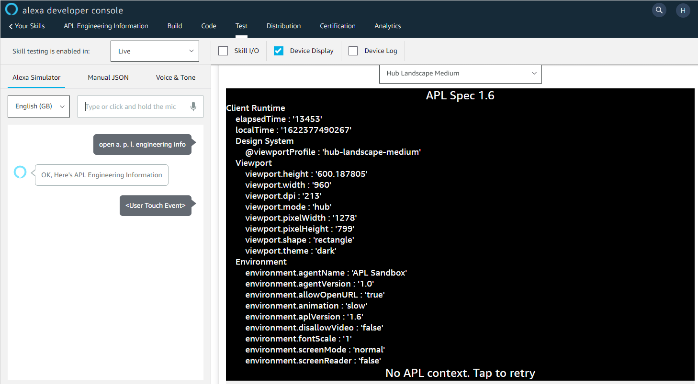

# APLInfoSkill

## What is this?

Alexa APL Engineering Info - displays details about screened Alexa devices.

## Why do you want it?

Different Alexa devices have different display characteristics.  If you have an APL skill that looks strange on a new device, you can use this skill to capture characteristics such as screen size and API.

You should see something like this:

## What does this tell you?
- APL Specification Version
- What [Alexa Responsive Layouts viewportProfile](https://developer.amazon.com/en-US/docs/alexa/alexa-presentation-language/apl-alexa-viewport-profiles-package.html#viewport-profile-resource-viewportprofile) was used.
- The [Viewport information is visible in the APL runtime](https://developer.amazon.com/en-US/docs/alexa/alexa-presentation-language/apl-viewport-property.html)
- The [Viewport information visisble to the Alexa Skill](https://developer.amazon.com/en-US/docs/alexa/alexa-presentation-language/apl-interface.html#viewport-properties)
- We also post an event back which lets us extract the runtime version.

## How do you use it?

Sign in to your Amazon account then:

- [Launch on a device via this launch link](https://alexa-skills.amazon.com/apis/custom/skills/amzn1.ask.skill.1e48aaf2-8d93-4c18-94f5-5f668eaf0614/launch)

- [Enable/Disable in the Amazon Store](https://www.amazon.co.uk/Edonica-APL-Engineering-Information/dp/B08CVCC9WY) then say "Alexa, open A P L Engineering Info"

## How do you update it?

If you want to deploy a new instance of the skill, you can use the [Alexa Skills Kit](https://developer.amazon.com/en-US/docs/alexa/alexa-skills-kit-sdk-for-nodejs/set-up-the-sdk.html) to deploy.

That may be a bit of a learning exercise, but should get everything setup in your AWS and Alexa developer account.

